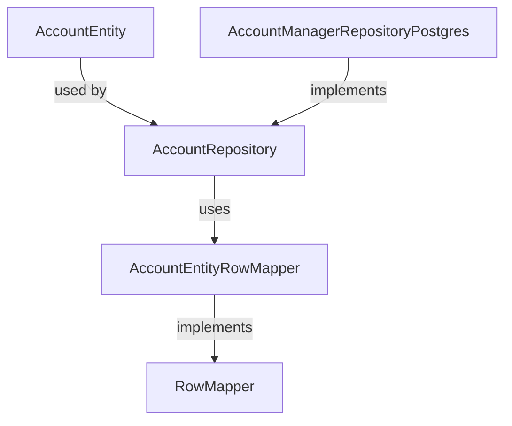
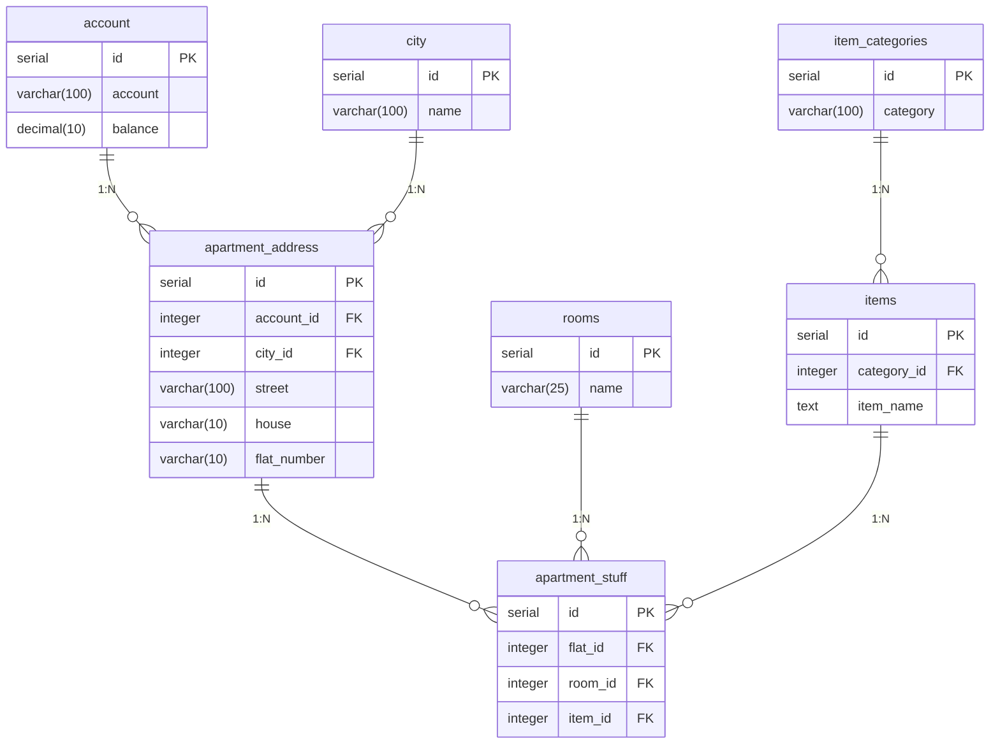

# Планировщик затрат на обустройство квартиры/дома во время ремонта (Web/App)

## Основная информация
- **Название**: Renovation Planner
- **Версия**: 0.1
- **Дата создания**: 26 апреля 2026 г.
- **Автор**: Vladimir Sarychev
- **Категория**: Веб-приложение для планирования ремонта (+ mobile)

## Подробное описание
Веб-сайт позволяет пользователям регистрироваться и авторизоваться для личного или совместного планирования ремонта.
После авторизации открывается личный кабинет — дашборд с проектами (квартиры, частные дома, объекты) в виде списка/карточек с превью.
Для каждого проекта: помещения, списки техники/мебели с заметками, ценами, статусом и возможностью прикреплять фотографии (из галереи или URL).
Помещения: стандартные названия (кухня, спальня, ванная, коридор для квартир; гараж, подвал для домов) или кастом.
Совместная работа: делиться проектами/помещениями с друзьями, фото видны всем участникам.
Целевая аудитория: Владельцы квартир/домов, проводящие ремонт самостоятельно или с командой.

## Функциональные возможности
- **Авторизация и кабинет**: Логин/регистрация; дашборд с проектами и превью.
- **Управление проектами**: В кабинете создавать/управлять (квартиры/дома); тип, адрес, помещения; приглашения.
- **Помещения и покупки**: Названия помещений (ванная, спальня, коридор/гараж); добавление техники/мебели с названием, ценой, статусом **и прикреплением фотографий** (загрузка файлов или ссылки).
- **Совместная работа**: Делиться проектами/помещениями; realtime + общие фото.[web:20]
- **Дополнительно**: Бюджет, поиск, экспорт с фото.

## Инструкция по использованию
1. Войдите в личный кабинет, создайте проект.
2. Добавьте помещения и элементы (техника/мебель), **прикрепите фото** (кнопка загрузки).
3. Делитесь с друзьями — фото синхронизируются.
4. Просматривайте превью с фото в дашборде.

### Технологии
- Python
- Docker
- Postgres

Для визуализации схем в readme.md нужно установить плагин mermaid

### TODO
 -[ ] Предложить пополнить баланс
 -[ ] Выбрать город
 -[ ] Выбрать адрес
 -[ ] Выбрать комнату
 -[ ] Указать покупку
 -[ ] Указать сумму
 -[ ] Вывести полный список трат
 -[ ] Уточнить нужно ли еще что-то ввести


### Docker
#### Запуск в контейнере необходимой версии PostgreSQL, переопределение суперпользователя и создание базы данных с нужным именем

```
docker run --name appart-pg-17.2 -p 5433:5432 -e POSTGRES_USER=postgres -e POSTGRES_PASSWORD=postgres -e POSTGRES_DB=apartment -d postgres:17.2
```

```
docker compose up -d
```

#### Инициализацию БД можно запустить через однострочник, но в этом случае требуется указывать абсолютный путь до каталога со скриптами:
```
docker run --name appart-pg-17.2 -p 5433:5432 -e POSTGRES_USER=postgres -e POSTGRES_PASSWORD=postgres -e POSTGRES_DB=apartment  -d -v "/absolute/path/to/directory-with-init-scripts":/docker-entrypoint-initdb.d postgres:17.2
```

```
psql -U postgres -d apartment
```

#### Скрипт удаляет всё контейнеры, образы, тома, сети одной командой
```
./clean-docker.sh
```

#### Скрипт автоматизирует очистку и перезапуск Docker Compose (Остановка и удаление контейнеров, сетей и томов и "висячих" образов)
```
./restart-docker-compose.sh
```

### Postgres



#### Связи:

city ||--o{ apartment_address: Один город может иметь много адресов квартир (связь "один ко многим").

item_categories ||--o{ items: Одна категория может содержать много товаров (связь "один ко многим").

